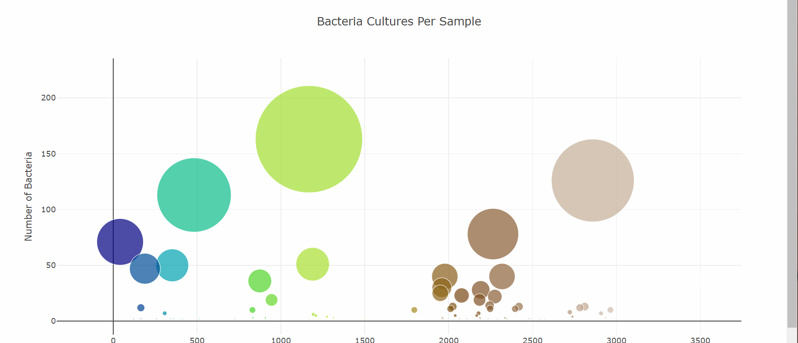

# Belly-button challenge

## Website: 
[website](https://paolavdw.github.io/belly-button-challenge/)

## Description
Dashboard that provides biodiversity information and charts

## Table of Contents
- [Installation](#installation)
- [Usage](#usage)
- [Credits](#credits)
- [License](#license)
- [Features](#features)

- [Contact](#contact)

## Installation
html, js, d3, plotly, css

## Usage
as a website

## Credits
Paola

## License
MIT

## Features
barcharts, bubblecharts, tabulear information

## Contact
If there are any questions or concerns, I can be reached at:
##### [github: paolavdw](https://github.com/paolavdw)
##### [email: paola.guigou@gmail.com](mailto:paola.guigou@gmail.com)
